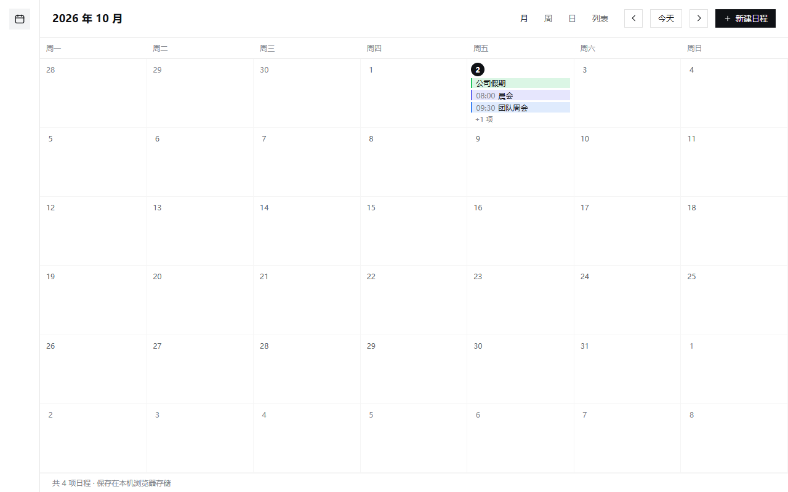
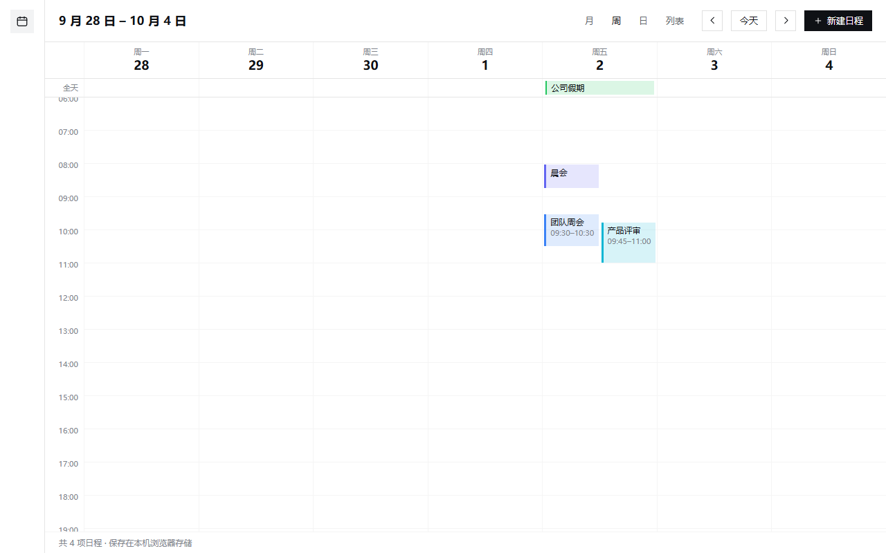
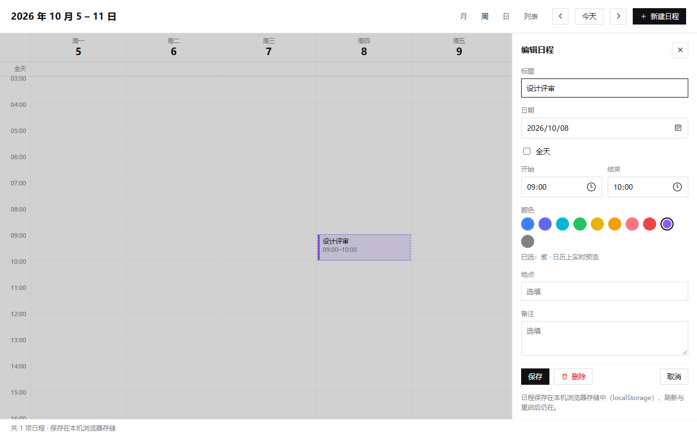
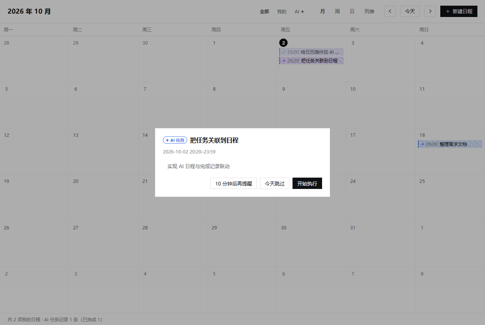

# 日程 — Harness 日历插件

一个把日历带进 DeepSeek Harness Web UI 的插件：侧边栏「自动化任务」下面是「日程」，
点开是一个完整的日历页面（月 / 周 / 日 / 列表四种视图、事件增删改、本机持久化）。





## 功能

| 能力 | 说明 |
|---|---|
| 视图 | 月、周、日、列表（Agenda，未来 60 天） |
| 新建 | **双击**月视图格子、**双击**周/日视图时段，或点「新建日程」按钮（单击不触发，避免误操作） |
| 编辑 / 删除 | **双击**任意事件（月视图色条、时间块、全天条、列表行均可）→ 右侧面板，可改可删 |
| 字段 | 标题、日期、全天、开始/结束时间、颜色（**10 色**）、地点、备注、**是否 AI 任务** |
| 实时预览 | 选颜色、改标题/时间/全天/来源时，**日历上立刻**画出未保存的虚线预览块；保存后才落盘 |
| 导航 | ‹ 今天 ›、视图切换；周/日视图自动滚到当前时刻并画当前时间线 |
| 持久化 | 我的日程存本机浏览器 `localStorage`（`dsh.calendar.events.v1`）；AI 任务记录存宿主文件 |
| 主题 | 宿主主题变量（`--dsw-alias-*`）+ 5 个固定中调色相，明/暗主题下都保持可读 |
| 重叠 | 同一天时间重叠的事件自动并排分栏 |
| **来源区分** | AI 事件：虚线左边 + 斜纹底 + `✦` 标记；已完成记录再加 `✓` 且淡化。工具栏可切「全部 / 我的 / AI」 |
| **完成即入历** | 宿主尾随会话日志，**待办清单里完成的条目自动**变成日历上的 AI 事件（零散任务可用 `log-task.mjs` 补录） |
| **AI 日程** | 用户可在编辑器里把任意日程勾成「AI 任务」，到点会弹窗问要不要开始执行 |





## AI 任务通道

### 1. 完成的任务自动进日程

**默认自动**：宿主半在 `auto-log.mjs` 里尾随 Session 日志，任何一份待办清单里
`status` 变成 `completed` 的条目，都会被记成一条 AI 事件（带完成时刻）。无需 AI 额外操作。

- 信号来源：Session 日志里的 `todo/write` 事件（`$DSH_HOME/sessions/**/session.v4.jsonl.zstd`）
- 只跟**根会话**（带 `parentSession` 的子代理会话会被跳过，否则日历会被子任务刷屏）
- **不回放历史**：第一次看到某个会话时只做基线（记住已完成项、不生成记录），避免一装插件就灌进一堆旧任务
- 每 4 秒扫一次，单轮最多记 12 条，超出部分留到下一轮；解码 2.2MB 日志约 77ms
- 记录写在 `ai-tasks-auto.json`，**只由宿主写**，与手写的 `ai-tasks.json` 分开，不存在并发覆盖

代价说清楚：**只有走待办清单的工作才会被自动捕获**。零散的单步任务（没建清单）仍需手动补录：

```powershell
node log-task.mjs --title "上传插件到 GitHub 仓库" --at 2026-10-02T20:56 --minutes 20 --color green `
                  --prompt "初始化 git 仓库、提交 17 个文件并推送"
```

想把某个会话的**历史**待办完成项一次性补进日历（例如刚装上插件）：

```powershell
node log-task.mjs --backfill    # 把监听状态回退到会话开头，宿主会在随后几轮补齐
```

两条命令都可以用 `--list` 查看当前全部记录（手写 + 自动），`--remove <id>` 删除手写记录。

页面每 15 秒轮询 `GET /dsh-calendar/ai-tasks`（返回两份文件的合并），把它们画成 AI 事件
（`status: "done"` → `✓` 淡化）。

### 2. 用户自己加的 AI 日程

编辑器里勾「AI 任务（到点提示我开始执行）」即可。这类日程存在浏览器里，和我的记录一起显示，
但来源标记相同、行为一致。

### 3. 到点弹窗

对**今天已到开始时间**（45 分钟窗口内）的待执行 AI 日程，页面会弹出提示卡片（挂在
`shell.overlay`，所以不管你在哪个页面都会出现），三个按钮：

| 按钮 | 行为 |
|---|---|
| **开始执行** | `POST /dsh-calendar/start` → 宿主用内置 `schedule` 服务把任务作为一条提示投递进你当前所在会话（`after_seconds: 2`），**AI 随即开始干活**。服务不可用时自动兜底：任务复制到剪贴板 + 打开一个新会话 |
| 10 分钟后再提醒 | 本次稍后，10 分钟后重新弹 |
| 今天跳过 | 记为已处理，今天不再弹（下次同一条日程仍会提醒） |

「今天跳过」的状态存在 `localStorage`（`dsh.calendar.acked.v1`），删除宿主记录的状态存在
`dsh.calendar.hidden.v1`。

## 结构

这是一个 Harness **bundle**（宿主半 + 浏览器半），无需构建步骤：

| 文件 | 作用 |
|---|---|
| `package.json` | `dsh.bundle.patch` 指向 cordis 补丁；`dsh.client` 声明浏览器半（`platform: web`、`inject` 依赖） |
| `cordis.patch.yml` | 插入一行，把本包挂进插件树 |
| `index.js` | 宿主半：`GET /dsh-calendar/ai-tasks`（读 AI 任务日志）与 `POST /dsh-calendar/start`（把任务交给 `schedule` 服务投递进会话）；只接受回环请求 |
| `client.js` | 浏览器半：手写 `window.__ModuleLoader__.load({ id, factory })` 封套，React 从宿主模块表取。注册 4 个扩展点：侧边栏入口、日历页、全局提醒弹窗、会话 id 追踪 |
| `log-task.mjs` | 命令行工具：手动追加一条完成任务记录；`--backfill` 让自动监听重读历史 |
| `auto-log.mjs` | 自动记录：尾随 Session 日志的 `todo/write` 事件，把完成的待办条目写成日历记录 |
| `icon.svg` | 插件列表图标 |

注册的两个扩展点：

- `sidebar.panellist` — 侧边栏图标入口，`id: calendar`、`order: 11`（`插件` 是 0，`自动化任务` 是 10，所以它紧随其后）、`label: 日程`
- `main` — 页面本体，`key: calendar`（与侧边栏 id 相同，点击即打开）

## 安装

前置：DeepSeek Harness 桌面版（`desktop` profile 里带有内置的 `webServer`、`schedule` 与
`client-ui-*` bundle，本插件直接复用，无需另装依赖）。

### 从 GitHub 安装

```powershell
git clone https://github.com/xiaolan776/dsh-calendar-plugin.git
$dir = (Resolve-Path .\dsh-calendar-plugin).Path

# 桌面版默认安装位置；装在别处就换成实际路径
$dsh = "$env:LOCALAPPDATA\Programs\DeepSeek Harness\resources\runtime\cli\bin\dsh.cmd"

& $dsh plugin --profile desktop add "file:$dir"
```

- `--profile` 填你的 profile 名；当前会话里可用 `$env:DSH_PROFILE` 查看（桌面应用默认 `desktop`）。
- **装完必须重启 DeepSeek Harness 应用**才能生效：宿主半的两个 HTTP 路由只在进程启动时注册，
  只刷新页面只会重新加载浏览器半。
- 重启后侧边栏「自动化任务」下面会出现「日程」。

### 更新 / 卸载

```powershell
# 更新：先拉代码，再重装（profile 里存的是拷贝，不是链接，直接 pull 不会生效）
git -C <clone 目录> pull
& $dsh plugin --profile desktop remove "@local/dsh-calendar-plugin"
& $dsh plugin --profile desktop add "file:<clone 目录>"

# 卸载
& $dsh plugin --profile desktop remove "@local/dsh-calendar-plugin"
```

### 本地开发

仓库没有构建步骤，改完 `client.js` / `index.js` 直接重装即可：

```powershell
# 首次安装（把路径换成你的工作目录）
& $dsh plugin --profile desktop add "file:E:/chronos-master/dsh-calendar-plugin"

# 改了源码
& $dsh plugin --profile desktop remove "@local/dsh-calendar-plugin"
& $dsh plugin --profile desktop add "file:E:/chronos-master/dsh-calendar-plugin"
```

只想调界面时，可以不重装：用浏览器直接打开插件源码所在的开发页（需要自己起一个静态服务），
或者干脆改完重装 + 刷新页面——重装只要 1 秒。

## 数据

| 数据 | 位置 | 归属 |
|---|---|---|
| 我的日程 / 用户建的 AI 日程 | 浏览器 `localStorage`：`dsh.calendar.events.v1` | 浏览器 |
| 视图偏好 | `localStorage`：`dsh.calendar.view.v1` | 浏览器 |
| 提醒已处理 / 稍后提醒 | `localStorage`：`dsh.calendar.acked.v1` | 浏览器 |
| 删除过的宿主记录 | `localStorage`：`dsh.calendar.hidden.v1` | 浏览器 |
| **AI 任务记录（手动补录）** | `$DSH_HOME/calendar-plugin/ai-tasks.json` | **宿主文件，可直接编辑** |
| **AI 任务记录（自动捕获）** | `$DSH_HOME/calendar-plugin/ai-tasks-auto.json` | **宿主写，勿手改** |
| 监听进度（每会话的读取偏移与已完成项） | `$DSH_HOME/calendar-plugin/watch-state.json` | 宿主写；删掉即重新基线 |

只在本机运行，不联网；两个宿主路由都只接受 127.0.0.1 / ::1 的请求，且仅 `webServer` 一个依赖。

## 已知边界

- 无重复日程（RRULE）、无系统级通知、无导入导出、无多日历订阅——本版只做本机单日历 + AI 通道。
- 时间按本地墙上时间处理，不含时区换算。
- AI 记录只有「追加」没有「回写」：用户在页面上删除/修改宿主记录仅作用于本机显示，不回改 JSON 文件。
- 「开始执行」依赖内置 `schedule` 服务（随「自动化任务」一起加载）。若该 bundle 被禁用，会自动走剪贴板兜底。

## 许可

[MIT](LICENSE) © 2026 xiaolan776
